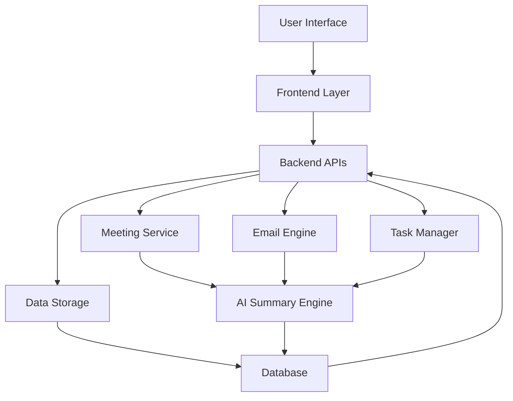
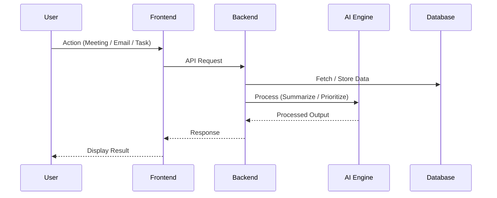
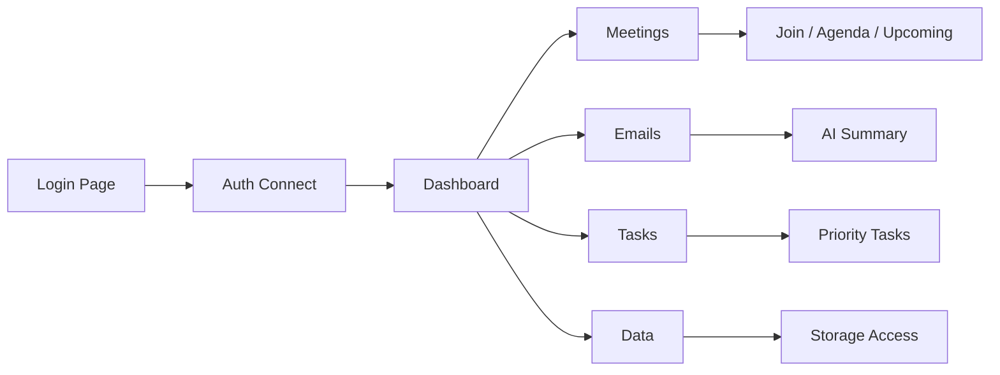
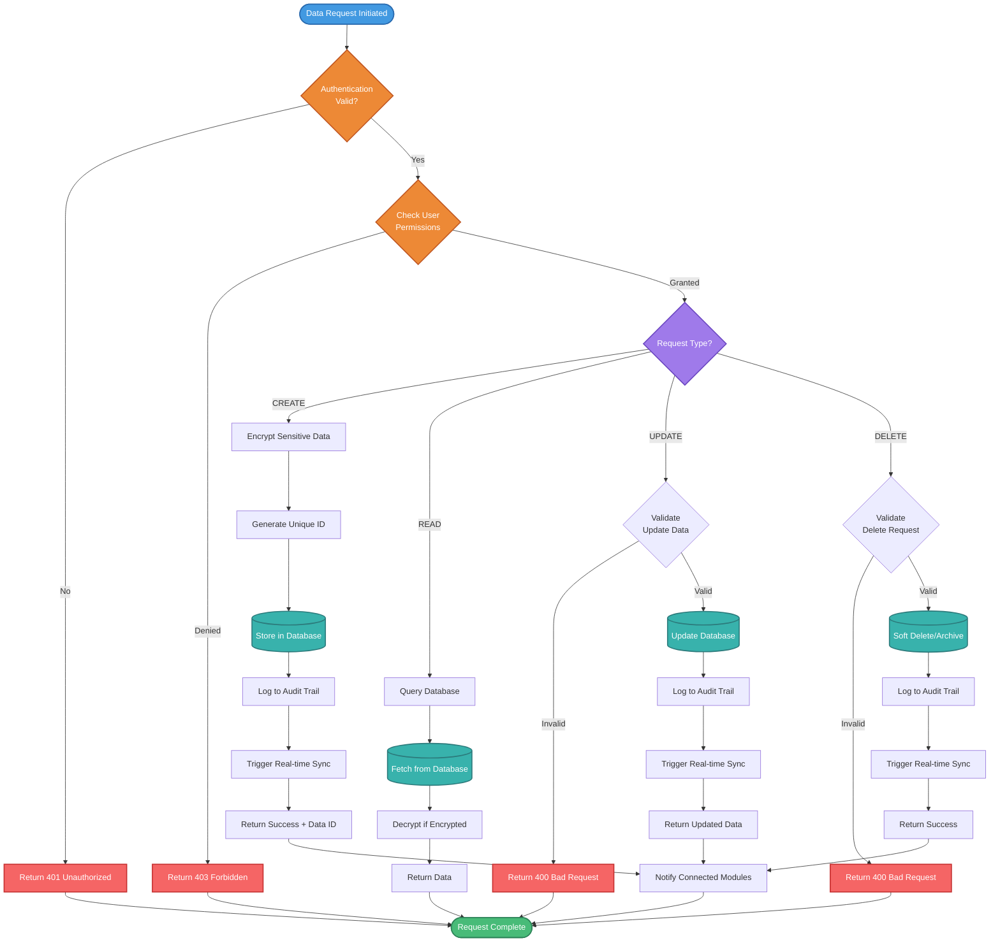

  

## 🧠 Vision
Build a next-gen corporate ecosystem where workflows are automated, communication is optimized, and decisions are AI-assisted.

## ⚙️ Core Modules

### 🟢 Meeting System
- Schedule & join meetings  
- Agenda management  
- AI-generated summaries  
- Calendar integration  

### 📧 Email Intelligence
- Smart inbox  
- AI summarization  
- Context extraction  

### ✅ Task & Workflow Manager
- Priority-based tasks  
- AI-generated suggestions  
- Workflow automation  

### 🗄️ Data Layer
- Centralized storage  
- Secure auth-based access  
- Historical project tracking  

---

## 🏗️ System Architecture

Eclipse 6.0 is built on a modular architecture that separates concerns while maintaining deep integration:

**Frontend Layer**
- Interactive UI/UX built with modern frameworks (React/Angular)
- Real-time updates and notifications
- Responsive design for desktop and mobile

**Backend Infrastructure**
- RESTful APIs for inter-module communication
- Microservices architecture for scalability
- Built-in data integration layer
- Role-based access control (RBAC)

**Tech Stack**
- **Frontend**: HTML5, CSS3, JavaScript (React/Vue/Angular)
- **Backend**: Node.js, Python, or Java (based on your framework choice)
- **Bundlers**: Webpack or equivalent
- **Preprocessors**: TypeScript, SASS/SCSS
- **Database**: Centralized storage with secure authentication

## 🔄 Workflow

### 📧 Email Intelligence
Transform your inbox from a cluttered mess into an organized command center.

**Key Features:**
- **Smart Inbox**: AI-powered categorization of emails (Priority, Normal, Low)
- **Multi-Email Management**: Handle multiple email accounts from a single interface
- **AI Summarization**: Get the gist of long email threads instantly
- **Context Extraction**: Automatically identify tasks, deadlines, and action items
- **Quick Actions**: One-click responses for common scenarios

**Email Categories:**
- 📌 **Email-1**: High-priority urgent messages
- 📬 **Email-2**: Standard business communication
- 📭 **Email-3**: Low-priority or informational emails

### ✅ Task & Workflow Manager
Keep your team aligned with intelligent task management and automated workflows.

**Key Features:**
- **Priority-Based Task Lists**: Automatically organize tasks by urgency and importance
- **AI Task Suggestions**: Get intelligent recommendations for task priorities
- **Workflow Automation**: Automate repetitive processes with custom triggers
- **Task Summaries**: Overview of all tasks with status tracking
- **Cross-Module Integration**: Tasks automatically created from emails and meetings

**Workflow Example:**

## 🧪 Feature Flow

### 🟢 Meeting System
Your intelligent meeting companion that handles everything from scheduling to post-meeting follow-ups.

**Key Features:**
- **Smart Scheduling**: Automatically find optimal meeting times across team calendars
- **Join with One Click**: Direct links for instant meeting access
- **Dynamic Agendas**: Create, share, and collaborate on meeting agendas in real-time
- **AI Summaries**: Automatically generate meeting summaries and action items
- **Calendar Sync**: Seamlessly integrates with existing calendar systems
- **Upcoming Meetings Dashboard**: See all scheduled meetings with priority indicators

**Flow:**

## 🗄️ Data Layer
The backbone that keeps everything connected and secure.

**Key Features:**
- **Centralized Storage**: Single source of truth for all organizational data
- **Secure Authentication**: Role-based access with wallet/auth integration
- **Historical Tracking**: Complete project history and audit trails
- **Data Synchronization**: Real-time sync across all modules
- **Access Control**: Granular permissions based on user roles

**Data Flow:**

 

 

  

