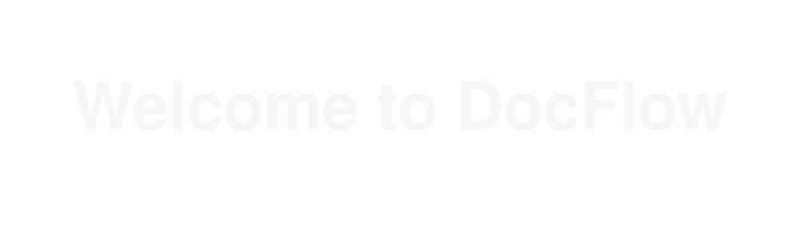
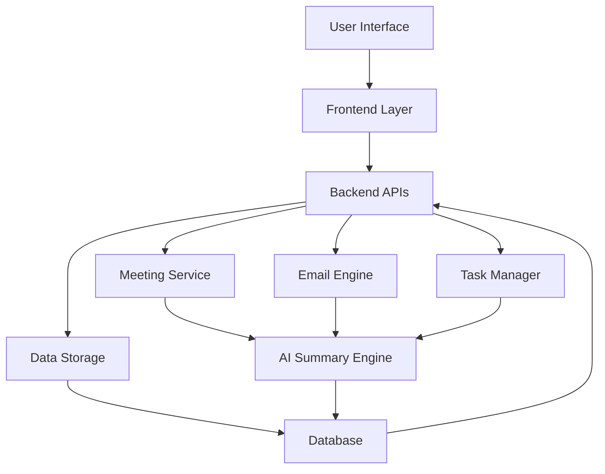
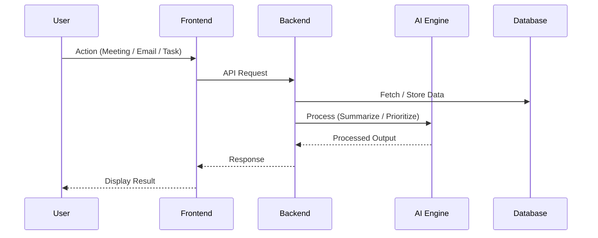
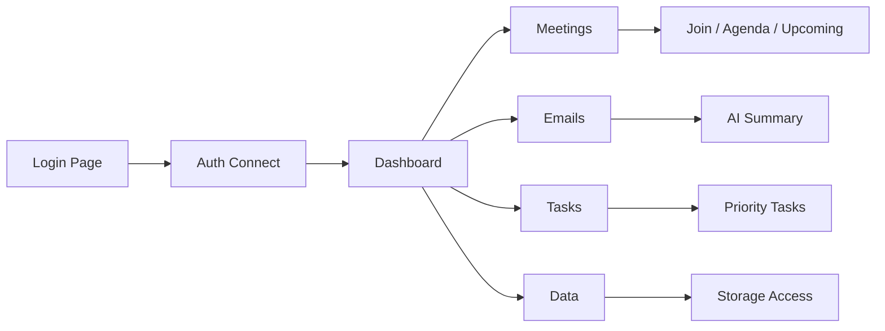

  

  

## 🛠️ Tech Stack

## 🧠 Vision
Build a next-gen corporate ecosystem where workflows are automated, communication is optimized, and decisions are AI-assisted.

---

## ⚙️ Core Modules

### 🟢 Meeting System
- Schedule & join meetings  
- Agenda management  
- AI-generated summaries  
- Calendar integration  

### 📧 Email Intelligence
- Smart inbox  
- AI summarization  
- Context extraction  

### ✅ Task & Workflow Manager
- Priority-based tasks  
- AI-generated suggestions  
- Workflow automation  

### 🗄️ Data Layer
- Centralized storage  
- Secure auth-based access  
- Historical project tracking  

---

## 🧩 System Architecture

## 🔄 Workflow

## 🧪 Feature Flow

